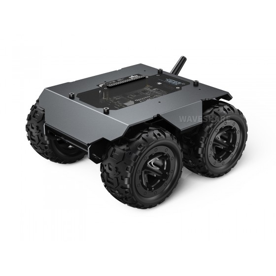
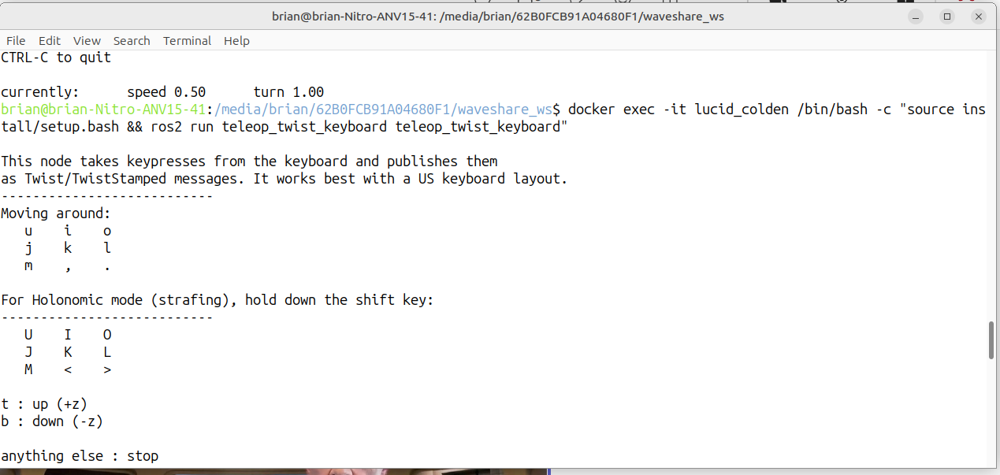

# Wave Rover Controller

This is a ROS 2 driver for Waveshare Wave Rover.
This repo is forked from https://github.com/antlassagne/ros2-wave-rover/tree/main. The main adjustments are:
- Updates for UART comms
- Added Keyboard controls
Should work with other waveshare robots based on JSON / UART communication (Offroad UGV, etc.)



## Features

- **ROS2 Integration**: Subscribes to `/cmd_vel` topic and converts geometry_msgs/Twist commands to motor control
- **UART Communication**: JSON-based protocol for reliable serial communication with the robot
- **Optional Joypad Support**: Built-in joystick controller for manual operation (not tested)
- **OLED Display Control**: Send messages and status information to the robot's OLED display
- **WiFi Management**: Configure robot's WiFi hotspot and scanning capabilities
- **Emergency Stop**: Safety mechanism for immediate robot halt
- **Multi-threaded Architecture**: Separate threads for ROS2 execution and UART communication
- **Configurable Parameters**: Adjustable speed scaling and UART device selection

## Package Information

- **Package Name**: `wave_rover_controller`
- **Version**: 0.0.0
- **License**: MIT
- **Maintainer**: briandeegan82 (brian.deegan82@gmail.com)

## Docker container
**Note**: It is strongly recommended to use Docker for consistent deployment (see Dockerfile included).
```bash
git clone https://github.com/EE5110-Sensing-Perception/WAVE-ROVER-Controller.git
cd WAVE-ROVER-Controller
docker build -t < container_tag > .
```

## Build from scratch (not recommended)
If building from scratch, follow these instructions
### Requirements

#### System Dependencies
```bash
sudo apt install -y qtcreator qtbase5-dev qt5-qmake cmake libqt5serialport5-dev
```

#### ROS2 Dependencies
- `rclcpp`
- `geometry_msgs`
- `ament_cmake`

#### Qt Dependencies
- Qt5 or Qt6 with Core and SerialPort components

### Building the Package
```bash
# Clone the repository
git clone https://github.com/EE5110-Sensing-Perception/WAVE-ROVER-Controller.git
cd WAVE-ROVER-Controller

# Build with colcon
colcon build --packages-select wave_rover_controller

# Source the workspace
source install/setup.bash
```

## Running the Driver
Start your docker container:
```bash
docker run --privileged -v /dev/ttyUSB0:/dev/ttyUSB0 -v /dev/input:/dev/input -it --rm < container_tag >
```
#### Basic Operation (without joypad)
Launch the driver node:
```bash
ros2 launch wave_rover_controller wave_rover_launch.py UART_address:="/dev/ttyUSB0"
```
Open a second terminal, and run teleop_twist_keyboard:
```bash
docker exec -it < container_id > /bin/bash -c "source install/setup.bash && ros2 run teleop_twist_keyboard teleop_twist_keyboard"

```


#### With Joypad Support
Same as above, but set the enable_joypad flag to 1:
```bash
ros2 launch wave_rover_controller wave_rover_launch.py enable_joypad:=1 UART_address:="/dev/ttyUSB0"
```

#### Manual Control via Joypad
```bash
ros2 launch wave_rover_controller control_launch.py
```

### Docker Deployment

#### Run on Robot
```bash
docker run --privileged -v /dev/ttyUSB0:/dev/ttyUSB0 -v /dev/input:/dev/input -it --rm <docker_build_tag> ros2 launch wave_rover_controller wave_rover_launch.py enable_joypad:=0 UART_address:="/dev/ttyUSB0"
```

#### Run Controller Remotely
```bash
docker run --privileged -v /run/udev:/run/udev -v /dev:/dev --name controller --net=host -it --rm <docker_build_tag>:latest ros2 launch wave_rover_controller control_launch.py
```

**Note**: Add `--restart=always` to automatically start the container on system boot.

## Configuration

### Launch Parameters

#### wave_rover_launch.py
- `enable_joypad` (default: '0'): Enable/disable joypad controller
- `UART_address` (default: '/dev/ttyUSB0'): Serial device path

#### control_launch.py
- `require_enable_button` (default: False): Require button press for control
- `axis_linear.x` (default: 4): Joystick axis for linear velocity
- `axis_angular.yaw` (default: 0): Joystick axis for angular velocity
- `scale_linear.x` (default: 1.0): Linear velocity scaling factor
- `scale_angular.yaw` (default: 1.0): Angular velocity scaling factor

### ROS2 Topics

#### Subscribed Topics
- `/cmd_vel` (geometry_msgs/msg/Twist): Velocity commands for robot movement

#### Published Topics
- None (this is a control-only node)

# Additional build options
Not critical for baseline operation.
## Docker Build

### Cross-compilation Setup

```bash
# Enable QEMU for cross-compilation
docker run --rm --privileged multiarch/qemu-user-static --reset -p yes
```

### Build Multi-platform Image
```bash
docker buildx build \
  --push \
  --tag your-registry/wave-rover-controller:latest \
  --platform linux/amd64,linux/arm64 .
```

### Build Single Platform
```bash
# For ARM64 (e.g., Raspberry Pi, Jetson)
docker buildx build --platform linux/arm64 -t wave-rover-controller:arm64 .

# For AMD64 (e.g., x86_64 systems)
docker buildx build --platform linux/amd64 -t wave-rover-controller:amd64 .
```

## Hardware Setup

### UART Connection
Communication is handled via the ESP32 USB. To connect to the ESP32, disconnect the bottom of the Rover, and plug in the USB C connector, as shown below. 

### udev Rules Setup
```bash
# Copy the provided udev rules
sudo cp 99-waverover.rules /etc/udev/rules.d/99-waverover.rules

# Or create custom rules for USB serial devices
sudo nano /etc/udev/rules.d/50-myusb.rules
```

Add the following content to `/etc/udev/rules.d/50-myusb.rules`:
```
KERNEL=="ttyUSB[0-9]*",MODE="0666"
KERNEL=="ttyACM[0-9]*",MODE="0666"
```

After creating the rules, unplug and reconnect the device.

## Testing and Debugging

### Virtual Serial Port (for testing)
```bash
# Create virtual serial ports for testing
socat -v -d -d PTY,raw,echo=0,b115200,cs8 PTY,raw,echo=0,b115200,cs8
```

### Manual Serial Communication
```bash
# Configure serial port
stty -F /dev/ttyUSB0 115200

# Monitor incoming data
cat /dev/ttyUSB0

# Send test commands
echo -ne "{\"T\":-3}\n" > /dev/ttyUSB0  # Reset OLED
echo -ne "{\"T\":1, \"L\":120, \"R\":120}\n" > /dev/ttyUSB0  # Move forward
```

### ROS2 Testing
```bash
# Send velocity commands
ros2 topic pub /cmd_vel geometry_msgs/msg/Twist "{linear: {x: 0.1, y: 0.0, z: 0.0}, angular: {x: 0.0, y: 0.0, z: 1.0}}"

# Monitor topics
ros2 topic list
ros2 topic echo /cmd_vel
```

## Protocol Reference

### JSON Command Format
The robot expects JSON commands with the following structure:
```json
{
  "T": <command_type>,
  "L": <left_motor_speed>,
  "R": <right_motor_speed>
}
```

### Command Types
- `-3`: OLED Reset
- `0`: Emergency Stop
- `1`: Speed Input (L: left motor, R: right motor, range: -255 to 255)
- `3`: OLED Set (lineNum: row, Text: content)

## Troubleshooting

### Common Issues
1. **Permission denied on serial port**: Ensure udev rules are properly configured
2. **No response from robot**: Check UART address and baud rate (115200)
3. **Joypad not working**: Verify joypad is connected and permissions are set
4. **Build errors**: Ensure all Qt dependencies are installed

### Logs and Debugging
```bash
# Enable verbose logging
export RCUTILS_LOGGING_SEVERITY_THRESHOLD=DEBUG

# Check serial port permissions
ls -la /dev/ttyUSB*

# Monitor system logs
journalctl -f
```

## Contributing

This project is based on the original work from [antlassagne/ros2-wave-rover](https://github.com/antlassagne/ros2-wave-rover) with the following enhancements:
- Updated UART communication protocol
- Added comprehensive joypad support
- Improved error handling and logging
- Enhanced documentation and configuration options

## License

MIT License - see package.xml for details.
