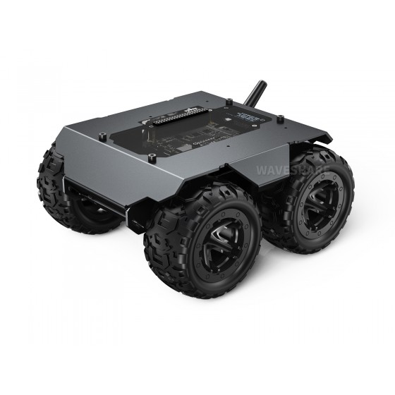

# Wave Rover Controller

ROS 2 driver for the Waveshare Wave Rover.  
Forked from [antlassagne/ros2-wave-rover](https://github.com/antlassagne/ros2-wave-rover).

The driver subscribes to **`/cmd_vel`** and converts `geometry_msgs/Twist` to motor commands over UART.  
Joystick, keyboard, and autonomous stacks all publish to `/cmd_vel` — the driver does not care which.



---

## Architecture

Driver and teleop are separate processes:

```
Terminal 1 (RB3)                    Terminal 2 (RB3 or host PC)
┌────────────────────────────┐      ┌─────────────────────────┐
│ wave_rover_launch.py       │      │ joy_linux_node          │
│   → wave_rover_controller  │      │ teleop_twist_joy        │
│       UART → ESP32 motors  │      │   (loads teleop_joy.yaml)│
└─────────────┬──────────────┘      └────────────┬────────────┘
              │  /cmd_vel  ◄──────────────────────┘
              │
              │  /cmd_vel  ◄── nav2 / your stack (autonomy)
```

Run gamepad teleop **on whichever machine has the USB device** (RB3 or host PC).  
Use the same `ROS_DOMAIN_ID` so `/cmd_vel` reaches the robot.

---

## Two ways to drive the rover

This package ships two `/cmd_vel` consumers — pick one:

| | C++ UART driver | Python WiFi bridge |
|--|------------------|--------------------|
| Transport | UART (`/dev/ttyUSB0`) | HTTP over WiFi (`http://<rover_ip>/js`) |
| Executable | `wave_rover_controller` | `wave_rover_bridge.py` |
| Launch | `wave_rover_launch.py` | `wave_rover_bridge_launch.py` |
| Config | `config/wave_rover_controller.yaml` | `config/wave_rover_bridge.yaml` |
| Extras | watchdog, deadband, OLED, liveness | watchdog, dead-reckoning `/odom` + TF, tank-drive `/joy` |

The Python bridge (`nodes/wave_rover_bridge.py`) is a pure-Python option that
needs no cross-compilation. Beyond converting `/cmd_vel` to motor commands it
also:

- publishes **dead-reckoning `/odom`** and broadcasts the `odom->base_link` TF
  (integrates *commanded* velocities — no encoders — so pair it with
  `slam_toolbox` to correct drift; set `publish_tf: false` if something else,
  e.g. `robot_localization`, owns that TF);
- subscribes to **`/joy` for tank-drive teleop** — hold the deadman button and
  the left/right sticks drive the wheels directly; release it to hand control
  back to `/cmd_vel` (Nav2 or `teleop_twist_joy`).

It speaks the rover's JSON command set over **either transport**, selected by the
`transport` param — the firmware accepts the identical `{"T":1,...}` commands
over WiFi or USB/UART:

| `transport` | Sends via | Params |
|-------------|-----------|--------|
| `http` (default) | `http://<rover_ip>/js?json=...` | `rover_ip`, `request_timeout` |
| `serial` | JSON line to a tty @115200 | `serial_port`, `baud_rate` |

It needs only `rclpy` (already on the ROS image). Each transport prefers a nicer
library but **falls back to the Python stdlib** if it's missing, so both work on
the bare QIR image with no extra packages:

- `http`: uses `python3-requests` if present, else stdlib `urllib`.
- `serial`: uses `python3-serial` (pyserial) if present, else a built-in
  `termios` writer.

**Connect the RB3 to the rover's WiFi first:**

- **AP mode (built-in hotspot):** join the rover's WiFi (SSID `UGV`, password
  `12345678`) — its IP is `192.168.4.1`. Note the RB3 leaves your other network
  while on the rover's AP.
- **STA mode:** point the rover at your router, then read its IP off the OLED.

Quick reachability test (no ROS needed) — a tiny forward nudge:

```bash
curl 'http://192.168.4.1/js?json={"T":1,"L":0.2,"R":0.2}'   # then L:0,R:0 to stop
```

Then run the bridge:

```bash
# Driver (WiFi bridge) — set rover_ip in config/wave_rover_bridge.yaml first
ros2 launch wave_rover_controller wave_rover_bridge_launch.py

# or directly (WiFi)
ros2 run wave_rover_controller wave_rover_bridge.py \
  --ros-args -p rover_ip:=192.168.4.1

# directly (USB/UART)
ros2 run wave_rover_controller wave_rover_bridge.py \
  --ros-args -p transport:=serial -p serial_port:=/dev/ttyUSB0
```

Gamepad/keyboard teleop works the same way for both — they all publish `/cmd_vel`.

---

## Quick start (RB3)

```bash
# Host: cross-compile and deploy (see Cross-compile section below)
cd WAVE-ROVER-Controller
./scripts/build.sh
./scripts/deploy.sh root@<rb3-ip>

# RB3: extract tarball, then:
mount -o remount,rw /usr
tar --no-overwrite-dir --no-same-owner -zxf /opt/wave_rover_controller.tar.gz -C /usr/
source /usr/share/qirp-setup.sh

# Terminal 1 — driver
ros2 launch wave_rover_controller wave_rover_launch.py
```

---

## Gamepad teleop

Start the driver first, then bring up the joy nodes in a **separate terminal**.
The quickest way is the bundled launch file (starts `joy_linux_node` +
`teleop_twist_joy`, loading `teleop_joy.yaml`):

```bash
ros2 launch wave_rover_controller teleop_joy_launch.py
```

Or run the two nodes by hand — both load settings from the same `teleop_joy.yaml`:

```bash
CONFIG=$(ros2 pkg prefix wave_rover_controller)/share/wave_rover_controller/config/teleop_joy.yaml
ros2 run joy_linux joy_linux_node --ros-args --params-file "$CONFIG"
ros2 run teleop_twist_joy teleop_node --ros-args --params-file "$CONFIG"
```

On a **host laptop** (ROS Jazzy installed, gamepad plugged into the laptop), the
`scripts/teleop.sh` helper sources `/opt/ros/jazzy`, sets `ROS_DOMAIN_ID=42` +
CycloneDDS, and launches both nodes — match the driver's `ROS_DOMAIN_ID`.

**All on one machine** (gamepad plugged into RB3):

```bash
# Terminal 1
ros2 launch wave_rover_controller wave_rover_launch.py

# Terminal 2
CONFIG=$(ros2 pkg prefix wave_rover_controller)/share/wave_rover_controller/config/teleop_joy.yaml
ros2 run joy_linux joy_linux_node --ros-args --params-file "$CONFIG"
ros2 run teleop_twist_joy teleop_node --ros-args --params-file "$CONFIG"
```

**Split** (driver on RB3, gamepad on host PC — same `ROS_DOMAIN_ID`):

```bash
# RB3 — driver only
ros2 launch wave_rover_controller wave_rover_launch.py

# Host PC — gamepad teleop (needs joy_linux + teleop_twist_joy installed)
CONFIG=$(ros2 pkg prefix wave_rover_controller)/share/wave_rover_controller/config/teleop_joy.yaml
ros2 run joy_linux joy_linux_node --ros-args --params-file "$CONFIG"
ros2 run teleop_twist_joy teleop_node --ros-args --params-file "$CONFIG"
```

> **Safety:** Ensure the robot is stationary before starting teleop.

> **Keyboard:** `config/teleop_keyboard.yaml` is available for manual `teleop_twist_keyboard` use (not bundled in deploy).

### Verify teleop config loaded

When `teleop_twist_joy` starts, it logs the active mapping. Compare against your `teleop_joy.yaml` — if you see package defaults (`enable_button` 5, `axis_linear.x` 5, `scale_linear.x` 0.5), the params file was not applied.

Example with current Microntek defaults in `teleop_joy.yaml`:

```
Teleop enable button 5.
Linear axis x on 1 at scale 0.300000.
Angular axis yaw on 0 at scale 1.000000.
```

The YAML keys must match the **ROS node names**, not the executable names:

| YAML section | Executable | ROS node name |
|--------------|--------------|---------------|
| `joy_node` | `joy_linux_node` | `joy_node` |
| `teleop_twist_joy_node` | `teleop_node` | `teleop_twist_joy_node` |

Use nested parameter groups (`axis_linear: { x: 1 }`) as in upstream `teleop_twist_joy` configs.

---

## Launch files & helper scripts

| Launch file | Brings up |
|-------------|-----------|
| `wave_rover_launch.py` | C++ UART driver (`wave_rover_controller`) |
| `wave_rover_bridge_launch.py` | Python WiFi/UART bridge (`nodes/wave_rover_bridge.py`, loads `wave_rover_bridge.yaml`) |
| `teleop_joy_launch.py` | `joy_linux_node` + `teleop_twist_joy` (loads `teleop_joy.yaml`) |
| `control_launch.py` | Same as above but using the `joy` package's `joy_node` (instead of `joy_linux`) |

| Helper script | Purpose |
|---------------|---------|
| `scripts/build.sh` / `scripts/deploy.sh` | Cross-compile + deploy via the shared `xcompile` toolkit |
| `scripts/teleop.sh` | Host-laptop gamepad teleop (ROS Jazzy + CycloneDDS, `ROS_DOMAIN_ID=42`) |
| `scripts/wave_rover_calc.py` | Offline `joy -> cmd_vel -> L/R` calculator for tuning scales / track width |

---

## Configuration

| File | What to tune |
|------|----------------|
| `config/wave_rover_controller.yaml` | C++ driver: serial port (`UART_address`), diff-drive (`wheel_separation`, `speed_scale`, `spin_boost`, `motor_deadband`, motor/clamp limits) |
| `config/wave_rover_bridge.yaml` | Python bridge: `transport` (http/serial), `rover_ip`, `track_width`, `max_speed`, odom frames, tank-drive joy axes |
| `config/joypad_builtin.yaml` | Optional overlay for the driver's onboard C++ joypad (`enable_joypad:=1`) |
| `config/teleop_joy.yaml` | Gamepad device, axes, buttons, stick sensitivity |
| `config/teleop_keyboard.yaml` | Keyboard speed / turn rate |

On RB3: `/usr/share/wave_rover_controller/config/`  
Edit, then **restart** the affected node (no rebuild needed for YAML-only changes).

> **Note:** the C++ driver reads the serial device from the `UART_address` key
> and uses a fixed 115200 baud. Set `UART_address` if you need a non-default port.

Driver startup log confirms config:

```
Config: UART=... speed_scale=... wheel_separation=... motor_deadband=...
```

---

## Cross-compile for RB3 Gen2 (QIR SDK)

Build bundles the driver plus `joy_linux` and `teleop_twist_joy` for the RB3.

```bash
cd <qirp-sdk>
source setup.sh

cd WAVE-ROVER-Controller
./scripts/build.sh
./scripts/deploy.sh root@<rb3-ip>
```

`build.sh` handles cross-compile hygiene automatically:

- Clears host ROS (`/opt/ros`) from prefix paths if present
- Unsets `LD_LIBRARY_PATH` (required by the QIR SDK)
- Uses the native x86 Python to run colcon
- Verifies all binaries are **aarch64**

If you prefer a clean shell, you can still run `unset LD_LIBRARY_PATH CMAKE_PREFIX_PATH AMENT_PREFIX_PATH COLCON_PREFIX_PATH` before `source setup.sh`.

For a full rebuild:

```bash
rm -rf build install log deps
./scripts/build.sh
```

See the QIR SDK `CROSS_COMPILE.md` in your SDK tree for the full workflow.

---

## ROS 2 topics

**C++ driver** (`wave_rover_controller`)
- Subscribed: `/cmd_vel` (`geometry_msgs/msg/Twist`)
- Published: `/cmd_vel_executed`, `/liveness`

**Python bridge** (`wave_rover_bridge.py`)
- Subscribed: `/cmd_vel` (`geometry_msgs/msg/Twist`), `/joy` (`sensor_msgs/msg/Joy`)
- Published: `/odom` (`nav_msgs/msg/Odometry`) + `odom->base_link` TF

---

## JSON protocol (UART)

```json
{"T": 1, "L": <left>, "R": <right>}
```

Motor command `T:1` with `L`/`R` in ±0.5 (firmware clamp). See source for OLED, WiFi, and e-stop commands.

---

## License

MIT
